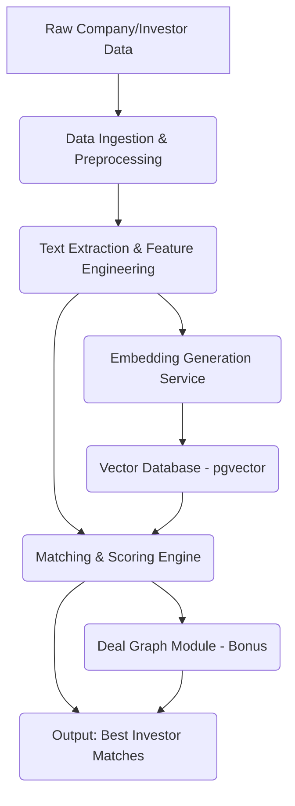


================================================================================
    INSTANT CONSULTANT - Job Description Mode
================================================================================

Generating professional Technical Design Document from job posting...

Parsing job description to extract requirements...
Parsed job description: Machine Learning Engineer for Deal Intelligence Platform (Pilot Project)
Extracted 9 features and 9 tech requirements
Analyzing architectural goal...
Goal: Project: Machine Learning Engineer for Deal Intelligence Platform (Pilot Project)

    Description: AI-driven platform for deal origination, connecting companies with investors and acquirers. Focus on initial pilot phase, creating core intelligence layer, and building a small prototype.

    Required Features:
    - Company and investor embeddings generation
- Basic matching model
- Small deal graph representation
- Simple scoring function (fit score)
- Extraction of text from company and investor data
- Generation of embeddings using specified tools
- Implementation of a simple vector search or similarity scoring mechanism
- Outputting a list of "best-matching investors for each company."
- Small graph structure and a simple centrality score (Bonus)

    Technical Requirements:
    - Python
- Machine Learning Fundamentals
- OpenAI
- HuggingFace
- Sentence Transformers
- Faiss
- pgvector
- Logistic regression
- XGBoost

    Timeline/Budget: Fixed budget of $150ΓÇô$300 for Milestone 1, depending on experience. Implied need for quick delivery of small results.
Retrieving code context and preferences...
Fetching coding preferences...
Searching coding_brain for: 'Project: Machine Learning Engineer for Deal Intelligence Platform (Pilot Project)

    Description: AI-driven platform for deal origination, connecting companies with investors and acquirers. Focus on initial pilot phase, creating core intelligence layer, and building a small prototype.

    Required Features:
    - Company and investor embeddings generation
- Basic matching model
- Small deal graph representation
- Simple scoring function (fit score)
- Extraction of text from company and investor data
- Generation of embeddings using specified tools
- Implementation of a simple vector search or similarity scoring mechanism
- Outputting a list of "best-matching investors for each company."
- Small graph structure and a simple centrality score (Bonus)

    Technical Requirements:
    - Python
- Machine Learning Fundamentals
- OpenAI
- HuggingFace
- Sentence Transformers
- Faiss
- pgvector
- Logistic regression
- XGBoost

    Timeline/Budget: Fixed budget of $150ΓÇô$300 for Milestone 1, depending on experience. Implied need for quick delivery of small results.'
No code examples found in coding_brain
Generating architectural design...
Design v1 generated 30316 characters.

================================================================================
  ARCHITECTURAL DESIGN DOCUMENT (v1)
================================================================================

# Technical Design Document: Deal Intelligence Platform (Pilot Project)

**Version:** 1.0
**Date:** October 26, 2023
**Author:** [Your Name/Company Name]

---

## 1. EXECUTIVE SUMMARY

This document outlines the technical design for the initial pilot phase of an AI-driven Deal Intelligence Platform. The platform aims to revolutionize deal origination by intelligently connecting companies seeking investment or acquisition with suitable investors and acquirers. This pilot project focuses on building the core intelligence layer, demonstrating key functionalities, and delivering a functional prototype. The primary objectives are to generate embeddings for companies and investors, develop a basic matching model, represent deal relationships in a small graph, and implement a scoring mechanism to identify the best investor matches for companies.

The success of this pilot will be measured by the successful generation of meaningful embeddings, the accuracy of the initial matching model, and the ability to present actionable investor recommendations. The expected business value lies in demonstrating the potential of AI to significantly streamline and enhance the deal origination process, reducing manual effort and improving the quality of connections. This pilot is designed for rapid delivery within a fixed budget, emphasizing quick iteration and tangible results.

---

## 2. REQUIREMENTS ANALYSIS

### 2.1 Functional Requirements

*   **FR1: Company and Investor Embeddings Generation:** The system shall generate numerical vector representations (embeddings) for companies and investors based on their textual data.
*   **FR2: Basic Matching Model:** The system shall implement a foundational model to assess the compatibility between companies and investors.
*   **FR3: Small Deal Graph Representation:** The system shall establish a basic graph structure to represent relationships between companies, investors, and potential deals.
*   **FR4: Simple Scoring Function (Fit Score):** The system shall calculate a "fit score" indicating the suitability of an investor for a given company.
*   **FR5: Text Extraction:** The system shall extract relevant textual information from company and investor data sources (e.g., descriptions, profiles).
*   **FR6: Embedding Generation Tool Integration:** The system shall utilize specified tools (OpenAI, HuggingFace Sentence Transformers) for generating embeddings.
*   **FR7: Vector Search/Similarity Scoring:** The system shall implement a mechanism to perform vector search or calculate similarity scores between company and investor embeddings.
*   **FR8: Output Best Matches:** The system shall output a ranked list of the "best-matching investors for each company."
*   **FR9 (Bonus): Simple Centrality Score:** The system shall calculate a simple centrality score for nodes within the deal graph.

### 2.2 Non-Functional Requirements

*   **NFR1: Performance:** The system should be able to generate embeddings and perform matching for a small dataset within a reasonable timeframe (e.g., minutes to hours for initial runs).
*   **NFR2: Scalability (Future Consideration):** While this is a pilot, the architecture should be designed with future scalability in mind, particularly for embedding generation and vector search.
*   **NFR3: Maintainability:** Code should be well-structured, documented, and follow Python best practices for ease of maintenance and future development.
*   **NFR4: Usability (for prototype):** The output of the prototype should be clear and easily interpretable by stakeholders.
*   **NFR5: Security:** While not a primary focus for this pilot, sensitive data handling should be considered in principle.

### 2.3 Constraints and Assumptions

*   **Constraint 1: Budget:** A fixed budget of $150-$300 for Milestone 1 necessitates efficient use of resources and potentially free/open-source tools where feasible.
*   **Constraint 2: Timeline:** Implied need for quick delivery of small results suggests an agile approach and focus on core functionality.
*   **Constraint 3: Technology Stack:** The use of Python, specific ML libraries (Sentence Transformers, Faiss), database (pgvector), and ML models (Logistic Regression, XGBoost) is mandated.
*   **Assumption 1: Data Availability:** Assumes access to a reasonably clean and structured dataset for companies and investors, including descriptive text.
*   **Assumption 2: Data Format:** Assumes data can be processed into a format suitable for text extraction and embedding generation.
*   **Assumption 3: OpenAI API Access:** Assumes access to OpenAI API keys and understanding of their usage policies and costs.
*   **Assumption 4: Pilot Scope:** This pilot focuses on core intelligence and a small prototype, not a full-fledged production system.

---

## 3. SYSTEM ARCHITECTURE

### 3.1 High-Level Architecture Diagram Description

The system will follow a modular, data-centric architecture. The core components include:

1.  **Data Ingestion & Preprocessing:** Responsible for loading and cleaning raw company and investor data.
2.  **Text Extraction & Feature Engineering:** Extracts relevant textual features from the preprocessed data.
3.  **Embedding Generation Service:** Utilizes specified tools to generate vector embeddings for companies and investors.
4.  **Vector Database:** Stores the generated embeddings for efficient similarity search (pgvector).
5.  **Matching & Scoring Engine:** Implements the matching logic, similarity scoring, and the fit score calculation.
6.  **Deal Graph Module (Bonus):** Manages the representation and analysis of the deal graph.
7.  **Output & Reporting:** Generates the final list of best-matching investors.



### 3.2 System Components and Their Responsibilities

*   **Data Ingestion & Preprocessing:**
    *   **Responsibility:** Load data from various sources (e.g., CSV, JSON). Clean and standardize data (handle missing values, normalize text).
*   **Text Extraction & Feature Engineering:**
    *   **Responsibility:** Identify and extract key textual fields (e.g., company description, investor focus, industry). Potentially perform basic text cleaning (stopwords, punctuation).
*   **Embedding Generation Service:**
    *   **Responsibility:** Interface with OpenAI and HuggingFace Sentence Transformers to generate high-quality embeddings from extracted text. Manage API calls and model loading.
*   **Vector Database (pgvector):**
    *   **Responsibility:** Store company and investor embeddings. Provide efficient indexing and similarity search capabilities.
*   **Matching & Scoring Engine:**
    *   **Responsibility:**
        *   Implement similarity search using Faiss or pgvector's capabilities.
        *   Calculate cosine similarity or other distance metrics between company and investor embeddings.
        *   Implement a basic matching model (e.g., Logistic Regression on similarity scores and other features) or a direct scoring function.
        *   Calculate the "fit score."
*   **Deal Graph Module (Bonus):**
    *   **Responsibility:** Represent entities (companies, investors) and relationships (e.g., "invests in," "seeks funding from") as a graph. Calculate simple centrality metrics.
*   **Output & Reporting:**
    *   **Responsibility:** Format and present the final output, including the ranked list of best-matching investors for each company.

### 3.3 Component Interactions and Data Flow

1.  Raw data is ingested and preprocessed.
2.  Relevant text is extracted and potentially cleaned.
3.  The extracted text is fed to the Embedding Generation Service, which produces vector embeddings.
4.  These embeddings are stored in the pgvector database.
5.  For a given company, its embedding is retrieved from the database.
6.  The Matching & Scoring Engine queries the Vector Database to find investors with similar embeddings (using Faiss or pgvector's ANN capabilities).
7.  The engine calculates similarity scores and applies the matching model/scoring function to derive a "fit score."
8.  (Bonus) The Deal Graph Module updates the graph with new relationships and calculates centrality.
9.  The engine compiles the ranked list of investors based on their fit scores for the company.
10. The final output is presented.

### 3.4 Architectural Patterns and Rationale

*   **Modular Design:** Each component is designed to be independent, allowing for easier development, testing, and future upgrades. This aligns with good software engineering practices.
*   **Data-Centric Architecture:** The system is designed around the data (embeddings) and how it's processed and queried. This is crucial for ML-driven applications.
*   **Microservices (Consideration for Future):** While not strictly required for this pilot, the modular design lays the groundwork for potential future migration to microservices if the platform scales significantly.
*   **Separation of Concerns:** Embedding generation, storage, and matching logic are separated, promoting maintainability and testability.
*   **Use of Specialized Libraries:** Leveraging libraries like Sentence Transformers for embeddings and Faiss/pgvector for vector search is a pragmatic approach to utilize state-of-the-art tools efficiently.

---

## 4. TECHNOLOGY STACK

### 4.1 Recommended Technologies with Justification

*   **Programming Language:** Python (Mandated) - Rich ecosystem for ML, data science, and web development.
*   **Machine Learning Fundamentals:** Core understanding is required for model implementation and evaluation.
*   **OpenAI:** For leveraging powerful pre-trained language models (e.g., text-davinci-003, GPT-3.5 Turbo) for embedding generation or potentially text summarization/feature extraction. *Justification: State-of-the-art performance for various NLP tasks.*
*   **HuggingFace (Sentence Transformers):** For efficient and high-quality sentence/text embedding generation using transformer models. *Justification: Open-source, performant, and widely adopted for embedding tasks.*
*   **Faiss:** A library for efficient similarity search and clustering of dense vectors. *Justification: Highly optimized for large-scale vector search, can be used locally or integrated.*
*   **pgvector:** PostgreSQL extension for storing, indexing, and searching vector embeddings. *Justification: Integrates vector search directly into a robust relational database, simplifying data management and allowing SQL queries alongside vector search.*
*   **Logistic Regression & XGBoost:** (Mandated) For building the basic matching model. *Justification: Widely used, interpretable (Logistic Regression), and powerful (XGBoost) algorithms for classification/regression tasks.*

### 4.2 Frontend Technologies (Not Applicable for Pilot)

This pilot focuses on the backend intelligence layer and a prototype output. A frontend is not required at this stage.

### 4.3 Backend Technologies

*   **Python Framework:** Flask or FastAPI (for potential API exposure if needed, but not strictly required for the pilot's core functionality). Flask is simpler for rapid prototyping.
*   **Data Handling:** Pandas for data manipulation.
*   **Numerical Computation:** NumPy.

### 4.4 Database and Storage Solutions

*   **Primary Database:** PostgreSQL with the `pgvector` extension. *Justification: Combines relational data management with efficient vector storage and search capabilities.*
*   **Local Storage:** For intermediate data files (e.g., CSVs) during development.

### 4.5 DevOps and Deployment Tools

*   **Version Control:** Git (GitHub/GitLab/Bitbucket).
*   **Environment Management:** `venv` or `conda`.
*   **Containerization (Optional for Pilot):** Docker (for consistency, but may be overkill for a small pilot).
*   **CI/CD (Future Consideration):** GitHub Actions, GitLab CI.

### 4.6 Third-Party Services and Integrations

*   **OpenAI API:** For accessing their embedding models. Requires API key management.

---

## 5. DATA MODEL

### 5.1 Key Entities and Their Attributes

*   **Company:**
    *   `company_id` (Unique Identifier)
    *   `name` (String)
    *   `description` (Text - source for embedding)
    *   `industry` (String)
    *   `funding_stage` (String)
    *   `company_embedding` (Vector - generated)
    *   `other_textual_features` (Text)
*   **Investor:**
    *   `investor_id` (Unique Identifier)
    *   `name` (String)
    *   `focus_areas` (Text - source for embedding)
    *   `investment_stage` (String)
    *   `investor_embedding` (Vector - generated)
    *   `other_textual_features` (Text)
*   **Deal (Optional for Graph):**
    *   `deal_id` (Unique Identifier)
    *   `company_id` (Foreign Key)
    *   `investor_id` (Foreign Key)
    *   `status` (String - e.g., "potential," "active," "closed")

### 5.2 Entity Relationships (ERD Description)

*   **Companies and Investors:** These are the primary entities for which embeddings will be generated. They are distinct entities.
*   **Company <-> Investor (Potential Deal):** A many-to-many relationship can be represented. A company might seek funding from multiple investors, and an investor might invest in multiple companies. This relationship forms the basis of the deal graph.
*   **pgvector Integration:** Embeddings will be stored as a vector type within the respective Company and Investor tables (or a dedicated embedding table linked to them).

### 5.3 Data Access Patterns

*   **Embedding Generation:** Read textual features from Company/Investor entities.
*   **Vector Search:** Query the `pgvector` database using a company's embedding to find nearest neighbor investor embeddings.
*   **Matching & Scoring:** Retrieve additional features for companies and investors from the relational part of the database to augment the similarity scores for the matching model.
*   **Graph Traversal (Bonus):** Query relationships between entities in the graph database or through join tables if using PostgreSQL for graph representation.

### 5.4 Indexing and Optimization Strategies

*   **pgvector Indexing:** Utilize `ivfflat` or `hnsw` indexes within `pgvector` for efficient Approximate Nearest Neighbor (ANN) search on embeddings. The choice depends on the trade-off between search speed and accuracy. `hnsw` generally offers better performance.
*   **Database Indexing:** Standard B-tree indexes on primary keys and frequently queried columns (e.g., `company_id`, `investor_id`, `industry`).
*   **Text Preprocessing:** Efficient text cleaning and normalization to ensure consistent input for embedding models.
*   **Batch Processing:** Generate embeddings and ingest data in batches to optimize resource utilization.

---

## 6. API DESIGN (if applicable)

For this pilot, a formal API is not strictly required. The core functionality can be executed via Python scripts. However, if a simple interface is desired for demonstration:

### 6.1 RESTful API Endpoints (Example)

*   **POST `/generate_embeddings`:**
    *   **Description:** Triggers the generation of embeddings for companies and/or investors based on provided data.
    *   **Request Body:** JSON object specifying data source and entity types (e.g., `{"data_source": "csv", "entities": ["companies", "investors"]}`).
    *   **Response:** Status message and count of generated embeddings.
*   **POST `/find_matches`:**
    *   **Description:** Finds best investor matches for a given company or a list of companies.
    *   **Request Body:** JSON object specifying company IDs or criteria (e.g., `{"company_ids": ["comp_1", "comp_2"], "num_matches": 5}`).
    *   **Response:** JSON object containing a list of best matches for each company, including scores (e.g., `{"comp_1": [{"investor_id": "inv_A", "score": 0.95}, ...], ...}`).

### 6.2 Request/Response Formats

*   **JSON:** Standard format for request and response bodies.

### 6.3 Authentication and Authorization

*   **API Key:** For sensitive operations like embedding generation (if using paid APIs), an API key mechanism (e.g., passed in headers) would be necessary. For internal scripts, this might be managed via environment variables.

### 6.4 Rate Limiting and Security Measures

*   **OpenAI API Limits:** Adhere to OpenAI's rate limits.
*   **Input Validation:** Sanitize all incoming data to prevent injection attacks.

---

## 7. CODE STRUCTURE & ORGANIZATION

### 7.1 Directory Structure

```
deal_intelligence_pilot/
Γö£ΓöÇΓöÇ data/                  # Raw and processed data files
Γöé   Γö£ΓöÇΓöÇ raw/
Γöé   ΓööΓöÇΓöÇ processed/
Γö£ΓöÇΓöÇ notebooks/             # Jupyter notebooks for exploration and experimentation
Γö£ΓöÇΓöÇ src/                   # Source code
Γöé   Γö£ΓöÇΓöÇ __init__.py
Γöé   Γö£ΓöÇΓöÇ data_processing/   # Scripts for data ingestion and preprocessing
Γöé   Γöé   Γö£ΓöÇΓöÇ __init__.py
Γöé   Γöé   ΓööΓöÇΓöÇ loader.py
Γöé   Γö£ΓöÇΓöÇ embeddings/        # Scripts for embedding generation
Γöé   Γöé   Γö£ΓöÇΓöÇ __init__.py
Γöé   Γöé   ΓööΓöÇΓöÇ generator.py
Γöé   Γö£ΓöÇΓöÇ database/          # Database interaction logic (pgvector)
Γöé   Γöé   Γö£ΓöÇΓöÇ __init__.py
Γöé   Γöé   ΓööΓöÇΓöÇ vector_db.py
Γöé   Γö£ΓöÇΓöÇ matching/          # Matching and scoring logic
Γöé   Γöé   Γö£ΓöÇΓöÇ __init__.py
Γöé   Γöé   Γö£ΓöÇΓöÇ model.py
Γöé   Γöé   ΓööΓöÇΓöÇ scorer.py
Γöé   Γö£ΓöÇΓöÇ graph/             # Graph module (Bonus)
Γöé   Γöé   Γö£ΓöÇΓöÇ __init__.py
Γöé   Γöé   ΓööΓöÇΓöÇ graph_builder.py
Γöé   ΓööΓöÇΓöÇ utils/             # Utility functions
Γöé       Γö£ΓöÇΓöÇ __init__.py
Γöé       ΓööΓöÇΓöÇ helpers.py
Γö£ΓöÇΓöÇ tests/                 # Unit and integration tests
Γöé   Γö£ΓöÇΓöÇ __init__.py
Γöé   ΓööΓöÇΓöÇ ...
Γö£ΓöÇΓöÇ config/                # Configuration files (API keys, DB credentials)
Γö£ΓöÇΓöÇ main.py                # Main script to orchestrate the pipeline
Γö£ΓöÇΓöÇ requirements.txt       # Project dependencies
ΓööΓöÇΓöÇ README.md              # Project description and setup instructions
```

### 7.2 Module Organization

*   Modules are organized by functionality (data processing, embeddings, matching, etc.).
*   Each module will contain specific classes or functions related to its responsibility.
*   `main.py` will orchestrate the workflow by importing and calling functions from different modules.

### 7.3 Naming Conventions

*   **Files:** `snake_case.py`
*   **Directories:** `snake_case/`
*   **Variables:** `snake_case`
*   **Functions:** `snake_case()`
*   **Classes:** `CamelCase`
*   **Constants:** `UPPER_SNAKE_CASE`

### 7.4 Code Organization Principles

*   **DRY (Don't Repeat Yourself):** Abstract common logic into utility functions.
*   **Single Responsibility Principle (SRP):** Each module/class should have one primary responsibility.
*   **Readability:** Write clear, concise code with meaningful variable names and comments where necessary.
*   **Modularity:** Design components to be loosely coupled.

---

## 8. SECURITY CONSIDERATIONS

### 8.1 Authentication and Authorization Strategy

*   **OpenAI API Keys:** Store API keys securely using environment variables or a dedicated secrets management tool (e.g., HashiCorp Vault, AWS Secrets Manager ΓÇô though likely overkill for this pilot). Avoid hardcoding keys in the codebase.
*   **Database Credentials:** Similar to API keys, store database credentials securely.
*   **Access Control:** For the pilot, access will likely be controlled by who has access to the codebase and environment. For future iterations, role-based access control (RBAC) would be implemented.

### 8.2 Data Encryption (at rest and in transit)

*   **In Transit:** Use SSL/TLS for all communication with external services (OpenAI API) and the database (PostgreSQL).
*   **At Rest:** Sensitive data within the database (if any beyond embeddings) should be considered for encryption. PostgreSQL offers encryption capabilities. For this pilot, focus is on securing access credentials.

### 8.3 Input Validation and Sanitization

*   **All User/External Inputs:** Rigorously validate and sanitize all data received from external sources (e.g., CSV files, API requests) to prevent injection attacks (SQL injection, etc.) and ensure data integrity.

### 8.4 Security Best Practices

*   **Least Privilege:** Grant only necessary permissions to API keys and database users.
*   **Regular Updates:** Keep all libraries and dependencies updated to patch known vulnerabilities.
*   **Secure Coding:** Follow OWASP guidelines for secure coding practices.

---

## 9. SCALABILITY & PERFORMANCE

### 9.1 Expected Load and Growth Projections

*   **Pilot Phase:** Small dataset (e.g., 100-1000 companies/investors). Performance requirements are moderate.
*   **Future Growth:** The platform is expected to handle thousands or millions of companies and investors. Embedding generation and vector search will become critical performance bottlenecks.

### 9.2 Scalability Strategies

*   **Embedding Generation:**
    *   **Batch Processing:** Process data in batches.
    *   **Distributed Computing (Future):** Utilize frameworks like Spark or Dask for parallel processing if datasets become very large.
    *   **Optimized Models:** Use efficient Sentence Transformer models.
*   **Vector Search:**
    *   **pgvector Indexing:** Leverage `hnsw` or `ivfflat` indexes for efficient ANN search. Tuning index parameters is crucial.
    *   **Faiss:** If pgvector becomes a bottleneck, Faiss can be used as a standalone solution, potentially hosted on dedicated infrastructure.
    *   **Sharding/Replication:** For extremely large datasets, consider sharding the vector index across multiple servers.
*   **Database:** PostgreSQL can be scaled vertically (more powerful hardware) or horizontally (read replicas, sharding).

### 9.3 Caching Strategies

*   **Embedding Cache:** Cache generated embeddings to avoid redundant computation if the same text is processed multiple times.
*   **Query Results Cache:** Cache results of frequent similarity searches if applicable.

### 9.4 Performance Optimization Approaches

*   **Profiling:** Use profiling tools (e.g., `cProfile`) to identify performance bottlenecks in the Python code.
*   **Efficient Data Structures:** Utilize NumPy and Pandas effectively.
*   **Algorithmic Optimization:** Choose efficient algorithms for similarity search and matching.
*   **Hardware:** Ensure sufficient CPU, RAM, and potentially GPU resources for embedding generation.

---

## 10. IMPLEMENTATION PLAN

### 10.1 Phase 1: Core Foundation and MVP Features (Est. 1-2 Weeks)

*   **Objective:** Establish the core pipeline for data ingestion, embedding generation, storage, and basic matching.
*   **Tasks:**
    *   Set up Python environment and project structure.
    *   Implement data loading and basic preprocessing (Pandas).
    *   Integrate HuggingFace Sentence Transformers for embedding generation.
    *   Set up PostgreSQL with `pgvector`.
    *   Implement logic to store embeddings in `pgvector`.
    *   Implement basic cosine similarity calculation.
    *   Develop script to output "best-matching investors for each company" based purely on similarity.
    *   Basic unit tests for core components.
*   **Deliverables:** A working Python script that takes sample data, generates embeddings, stores them, and outputs a list of investor matches based on embedding similarity.
*   **Budget Focus:** Maximizing the use of free tiers/resources, efficient coding.

### 10.2 Phase 2: Enhanced Matching & Graph (Est. 1 Week)

*   **Objective:** Improve matching accuracy and introduce the deal graph concept.
*   **Tasks:**
    *   Integrate OpenAI for embedding generation (if Sentence Transformers prove insufficient or for comparison).
    *   Implement a simple Logistic Regression model using similarity scores and potentially other features for matching.
    *   Implement XGBoost model for comparison/enhancement.
    *   Develop the Deal Graph Module (using NetworkX or similar for in-memory graph, or basic PostgreSQL tables).
    *   Implement simple centrality score calculation (Bonus).
    *   Refine the output to include fit scores.
*   **Deliverables:** Enhanced matching logic, initial deal graph representation, and improved output format.

### 10.3 Phase 3: Optimization and Polish (Est. 0.5 - 1 Week)

*   **Objective:** Refine performance, add basic error handling, and prepare for demonstration.
*   **Tasks:**
    *   Optimize embedding generation and vector search performance.
    *   Add basic logging and error handling.
    *   Refactor code for clarity and maintainability.
    *   Prepare a demonstration script and sample output.
    *   Document the code and usage.
*   **Deliverables:** Optimized and polished prototype ready for stakeholder review.

### 10.4 Timeline Estimates

*   **Total Estimated Time:** 2.5 - 4 weeks. This is an aggressive estimate and depends heavily on data quality and developer efficiency.

### 10.5 Key Milestones and Deliverables

*   **Milestone 1 (End of Phase 1):** Functional MVP pipeline for embedding generation and basic similarity matching.
*   **Milestone 2 (End of Phase 2):** Enhanced matching model and initial deal graph implementation.
*   **Milestone 3 (End of Phase 3):** Optimized and documented prototype ready for demonstration.

---

## 11. TESTING STRATEGY

### 11.1 Unit Testing Approach

*   **Framework:** `pytest`.
*   **Scope:** Test individual functions and classes within modules (e.g., text cleaning functions, embedding generation wrappers, database connection logic, scoring functions).
*   **Mocking:** Mock external API calls (OpenAI) and database interactions where appropriate to isolate unit tests.

### 11.2 Integration Testing

*   **Scope:** Test the interaction between key components:
    *   Data loading -> Embedding generation -> Database storage.
    *   Embedding retrieval -> Similarity search -> Matching engine.
*   **Approach:** Use a small, representative dataset and a local PostgreSQL instance.

### 11.3 End-to-End Testing

*   **Scope:** Test the entire pipeline from raw data input to final output generation.
*   **Approach:** Run the `main.py` script with sample data and verify the final output format and content.

### 11.4 Performance Testing

*   **Scope:** Measure the time taken for critical operations (embedding generation, vector search) with increasing data sizes (simulated).
*   **Approach:** Use Python's `time` module or profiling tools. Test with datasets representative of expected pilot scale.

---

## 12. DEPLOYMENT & OPERATIONS

### 12.1 Deployment Pipeline

*   **Pilot Phase:** Manual deployment via running Python scripts.
*   **Future:** Automated deployment using CI/CD pipelines (e.g., GitHub Actions) to deploy to cloud environments (AWS, GCP, Azure).

### 12.2 Monitoring and Logging

*   **Logging:** Implement comprehensive logging throughout the application using Python's `logging` module to track execution flow, errors, and key metrics.
*   **Monitoring:**
    *   **Resource Usage:** Monitor CPU, memory, and disk usage of the PostgreSQL instance and any compute resources.
    *   **API Performance:** Track response times and error rates for API endpoints (if implemented).
    *   **OpenAI Usage:** Monitor API usage and costs.

### 12.3 Backup and Disaster Recovery

*   **Database Backups:** Configure regular automated backups for the PostgreSQL database.
*   **Code Backups:** Ensure all code is committed to version control (Git).
*   **Disaster Recovery Plan:** For the pilot, this is minimal. For production, a plan would involve restoring from backups and potentially replicating infrastructure.

### 12.4 Maintenance Considerations

*   **Dependency Updates:** Regularly update Python libraries and PostgreSQL extensions to patch security vulnerabilities and benefit from new features.
*   **Model Retraining:** Embeddings and matching models may need periodic retraining as new data becomes available or performance degrades.
*   **Cost Management:** Monitor OpenAI API costs and optimize usage.

---

## 13. RISKS & MITIGATION

### 13.1 Technical Risks

*   **Risk:** Poor quality of input data leads to inaccurate embeddings and matching.
    *   **Mitigation:** Implement robust data cleaning and validation steps. Clearly communicate data requirements to stakeholders. Explore data augmentation techniques if necessary.
*   **Risk:** OpenAI API costs exceed budget.
    *   **Mitigation:** Monitor usage closely. Optimize embedding generation by processing data in batches and potentially using Sentence Transformers as a primary or fallback option. Explore OpenAI's pricing tiers.
*   **Risk:** Performance bottlenecks in embedding generation or vector search for larger datasets.
    *   **Mitigation:** Optimize `pgvector` indexing. Profile Python code. Consider Faiss as an alternative if `pgvector` proves insufficient. Plan for future scaling strategies.
*   **Risk:** Difficulty integrating `pgvector` or managing PostgreSQL.
    *   **Mitigation:** Start with a simple local PostgreSQL setup. Utilize Docker for consistent environments. Leverage community support and documentation.

### 13.2 Project Risks

*   **Risk:** Scope creep beyond the pilot's defined features.
    *   **Mitigation:** Maintain strict adherence to the MVP scope. Document any requested changes and assess their impact on timeline and budget, deferring them to future phases.
*   **Risk:** Unrealistic expectations from stakeholders regarding AI capabilities.
    *   **Mitigation:** Clearly communicate the limitations of the pilot and the nature of AI models. Focus on demonstrating tangible progress and value.
*   **Risk:** Delays in data provision or feedback.
    *   **Mitigation:** Establish clear communication channels and timelines with stakeholders. Proactively follow up on data and feedback.

### 13.3 Mitigation Strategies Summary

*   **Agile Development:** Employ iterative development cycles with frequent check-ins.
*   **Proactive Communication:** Maintain open and transparent communication with stakeholders.
*   **Focus on MVP:** Prioritize core features for the pilot.
*   **Contingency Planning:** Allocate buffer time for unforeseen issues.
*   **Leverage Open Source:** Maximize the use of free and open-source tools where appropriate to manage costs.

---

================================================================================

