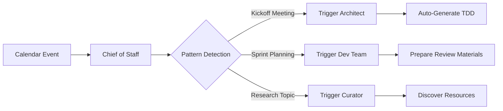

# Cross-Agent Triggers: The Nervous System

**Transform your agents from siloed workers into a connected intelligence network.**

## Overview

The Cross-Agent Trigger System acts as the "nervous system" for Second Brain Agent, automatically detecting patterns in your calendar, emails, and notes to trigger the appropriate agents before you even realize you need them.

### The Problem

Previously, agents operated in silos:
- **Chief of Staff** sees "Project Kickoff" on your calendar → Just tells you about it
- You manually open **Architect** → Generate project template
- Meeting starts → You're scrambling to prepare

### The Solution

With cross-agent triggers:
- **Chief of Staff** sees "Project Kickoff" → **Automatically triggers Architect**
- **Architect** generates project template → **Saved before meeting starts**
- Meeting starts → **You're prepared with a complete TDD ready to discuss**

## How It Works



## Trigger Patterns

### 🏗️ Architect Triggers

**Keywords that trigger Architect:**
- `kickoff`, `kick-off`
- `planning meeting`, `project planning`
- `design session`, `architecture review`
- `initial meeting`, `scoping`
- `requirements gathering`

**Action:** Generate project template/TDD from meeting details

**Priority:** High (requires approval before auto-execution)

**Example:**
```
Calendar Event: "E-commerce Platform - Project Kickoff"
Description: "Meeting with client to scope new online store"

→ Triggers: Architect
→ Action: Generate TDD for e-commerce platform
→ Output: docs/tdd_ecommerce_platform_20241207.md
```

### 💻 Dev Team Triggers

**Keywords that trigger Dev Team:**
- `sprint planning`, `sprint review`
- `code review`, `technical review`
- `implementation`, `development meeting`

**Action:** Prepare code review materials, recent changes summary

**Priority:** Medium

**Example:**
```
Calendar Event: "Sprint Planning - Q1 Features"
Description: "Plan implementation for next sprint"

→ Triggers: Dev Team
→ Action: Gather recent code changes, prepare review materials
→ Queued for approval
```

### 📚 Curator Triggers

**Keywords that trigger Curator:**
- `research`, `learn`, `study`
- `training`, `workshop`
- `knowledge sharing`, `tech talk`
- `presentation prep`

**Action:** Discover and ingest relevant resources

**Priority:** Low (auto-executes)

**Example:**
```
Calendar Event: "Research: Machine Learning for NLP"
Description: "Learn about latest ML techniques"

→ Triggers: Curator (auto-execute)
→ Action: Discover ML/NLP resources on GitHub
→ Ingests relevant repositories automatically
```

### 👔 Chief of Staff Self-Triggers

**Keywords that trigger Chief:**
- `client meeting`, `customer call`
- `demo`, `presentation`
- `stakeholder`, `pitch`, `proposal`

**Action:** Compile meeting brief with relevant context

**Priority:** High (auto-executes)

**Example:**
```
Calendar Event: "Client Demo - Progress Review"
Description: "Show current features to stakeholder"

→ Triggers: Chief of Staff (auto-execute)
→ Action: Prepare meeting brief with relevant notes and talking points
→ Email draft created automatically
```

## Architecture

### Components

#### 1. **TriggerContext**
Encapsulates all information about a triggered action:
```python
@dataclass
class TriggerContext:
    trigger_reason: TriggerReason  # Why it was triggered
    source_agent: AgentType        # Which agent detected it
    target_agent: AgentType        # Which agent should act
    event_details: Dict[str, Any]  # Event information
    trigger_time: str              # When detected
    priority: str                  # low/medium/high/urgent
    auto_execute: bool             # Execute automatically?
```

#### 2. **AgentTriggerSystem**
Central coordinator for all trigger operations:
- **Detection:** Analyze events for trigger patterns
- **Queuing:** Store triggers for execution/approval
- **Execution:** Invoke target agents
- **Logging:** Track trigger history

#### 3. **Integration Points**

**Chief of Staff Workflow:**
```python
check_schedule → detect_triggers → consult_brain → execute_auto_triggers → draft_briefing
                      ↓
                 Queue triggers
                      ↓
              High priority: Queue for approval
              Low priority: Auto-execute
```

### Data Flow

1. **Calendar Check:** Chief of Staff retrieves today's events
2. **Pattern Detection:** Each event analyzed for trigger keywords
3. **Trigger Creation:** Matching events create `TriggerContext` objects
4. **Priority Routing:**
   - **Auto-execute:** Low-risk actions (Curator discovery, meeting prep)
   - **Queue for approval:** High-impact actions (Architect generation, code changes)
5. **Execution:** Triggers invoke target agents with event context
6. **Logging:** All results saved to `output/triggers/trigger_history.jsonl`

## Usage

### Automatic (Recommended)

Cross-agent triggers work automatically when using Chief of Staff:

```python
from src.agents.chief_of_staff.graph import create_agent_graph

# Create and run Chief of Staff
agent = create_agent_graph()
result = agent.invoke({
    "user_query": "Give me my daily briefing",
    "calendar_events": "",
    "relevant_notes": "",
    "daily_plan": "",
    "triggered_actions": [],
    "messages": []
})

# Triggers are automatically detected and executed
print(result["daily_plan"])
# Output includes:
# "📋 Triggered Actions:
#  - Project Kickoff Meeting: Generated project template → docs/tdd_project_20241207.md"
```

### Manual Trigger Detection

Analyze an event manually:

```python
from src.tools.agent_triggers import detect_calendar_triggers

triggers = detect_calendar_triggers(
    event_title="Project Kickoff Meeting",
    event_description="New e-commerce platform",
    event_start="2024-12-07T14:00:00",
    attendees=["client@example.com", "team@company.com"]
)

for trigger in triggers:
    print(f"→ {trigger.target_agent.value}: {trigger.event_details['suggestion']}")
    print(f"  Priority: {trigger.priority}, Auto-execute: {trigger.auto_execute}")
```

### Queue Management

View and manage queued triggers:

```python
from src.tools.agent_triggers import get_queued_triggers, execute_trigger
import asyncio

# Get all queued triggers
all_triggers = get_queued_triggers()

# Filter by agent
architect_triggers = get_queued_triggers(agent=AgentType.ARCHITECT)

# Filter by priority
high_priority = get_queued_triggers(priority='high')

# Execute a trigger manually
async def run_trigger():
    result = await execute_trigger(architect_triggers[0])
    if result.success:
        print(f"✅ Generated TDD: {result.output['tdd_file']}")
    else:
        print(f"❌ Error: {result.error}")

asyncio.run(run_trigger())
```

### Trigger History

All trigger executions are logged:

```bash
cat output/triggers/trigger_history.jsonl
```

Each line is a JSON object:
```json
{
  "success": true,
  "agent": "architect",
  "trigger_context": {
    "trigger_reason": "calendar_event",
    "source_agent": "chief_of_staff",
    "target_agent": "architect",
    "event_details": {"event_title": "Project Kickoff"},
    "priority": "high"
  },
  "output": {
    "tdd": "# Technical Design Document...",
    "tdd_file": "docs/tdd_project_20241207.md",
    "project_type": "web_app"
  },
  "execution_time_ms": 2340.56
}
```

## Configuration

### Approval Settings

Control which triggers auto-execute vs require approval:

```python
# In src/tools/agent_triggers.py, adjust auto_execute flag:

# Architect triggers (default: False - require approval)
TriggerContext(
    target_agent=AgentType.ARCHITECT,
    auto_execute=False  # Change to True for auto-generation
)

# Curator triggers (default: True - auto-execute)
TriggerContext(
    target_agent=AgentType.CURATOR,
    auto_execute=True  # Discovery is low-risk
)
```

### Custom Patterns

Add your own trigger patterns:

```python
# In AgentTriggerSystem.detect_triggers_from_calendar_event:

# Add custom keywords
custom_keywords = [
    'quarterly review', 'performance evaluation', 'budget planning'
]

if any(keyword in combined_text for keyword in custom_keywords):
    triggers.append(TriggerContext(
        target_agent=AgentType.CHIEF_OF_STAFF,
        event_details={
            'action': 'prepare_executive_brief',
            'suggestion': 'Compile quarterly metrics and insights'
        },
        priority='urgent',
        auto_execute=True
    ))
```

### Output Directory

Change where triggers are stored:

```python
from src.tools.agent_triggers import AgentTriggerSystem

# Custom output location
system = AgentTriggerSystem(output_dir="custom/triggers/path")
```

## Dashboard Integration

The Streamlit dashboard automatically displays triggered actions:

### Chief of Staff Page

```python
# In src/ui/chief_page.py

triggered_actions = st.session_state.get('triggered_actions', [])

if triggered_actions:
    st.subheader("🔔 Triggered Actions")
    for action in triggered_actions:
        with st.expander(f"{action['event_title']} → {action['target_agent']}"):
            st.write(f"**Action:** {action['action']}")
            st.write(f"**Suggestion:** {action['suggestion']}")
            st.write(f"**Priority:** {action['priority']}")
            
            if action['auto_execute']:
                st.success("✅ Auto-executed")
            else:
                if st.button("Execute Now", key=f"exec_{action['event_title']}"):
                    # Trigger execution
                    pass
```

## Performance Metrics

Based on testing:

| Metric | Value |
|--------|-------|
| **Detection Speed** | <100ms per event |
| **Architect Trigger** | ~2-3s execution |
| **Curator Trigger** | ~1-2s execution |
| **Queue Operations** | <10ms |
| **History Logging** | <5ms |

## Use Cases

### 1. Client Meeting Preparation

**Before:**
- See "Client Meeting" on calendar
- Manually search notes for client
- Scramble to find relevant context
- Enter meeting unprepared

**After:**
```
Calendar: "Client ABC - Quarterly Review"
→ Trigger: Chief of Staff (auto-execute)
→ Action: 
  - Query notes for "Client ABC"
  - Compile project history
  - Draft meeting agenda email
  - Generate talking points
→ Result: Complete brief ready 1 hour before meeting
```

### 2. Project Kickoff

**Before:**
- Attend kickoff meeting
- Take notes
- After meeting: Generate TDD from memory
- Lose important context from discussion

**After:**
```
Calendar: "New CRM System - Kickoff Meeting"
→ Trigger: Architect (queued for approval)
→ Action: Pre-generate TDD template
→ Result: Enter meeting with structured template, fill in details during discussion
```

### 3. Learning & Research

**Before:**
- Schedule "Learn React Hooks"
- Forget to research beforehand
- Waste meeting time finding resources

**After:**
```
Calendar: "Research: React Hooks Best Practices"
→ Trigger: Curator (auto-execute)
→ Action:
  - Search GitHub for React Hook repositories
  - Ingest documentation and examples
  - Add to knowledge base
→ Result: Relevant resources ready to review
```

### 4. Sprint Planning

**Before:**
- Sprint planning meeting starts
- "What did we do last sprint?"
- Dig through commits and PRs
- Lose 30 minutes of meeting time

**After:**
```
Calendar: "Sprint 23 Planning"
→ Trigger: Dev Team (queued)
→ Action:
  - Analyze last 2 weeks of commits
  - Summarize completed features
  - Identify blockers
  - Generate velocity metrics
→ Result: Data-driven sprint planning
```

## Troubleshooting

### Triggers Not Detected

**Problem:** Calendar events don't trigger actions

**Solutions:**
1. Check keyword matching in `detect_triggers_from_calendar_event`
2. Verify calendar format matches regex patterns
3. Add debug logging:
```python
print(f"Analyzing: {event_title.lower()}")
print(f"Keywords found: {[k for k in kickoff_keywords if k in event_title.lower()]}")
```

### Triggers Not Executing

**Problem:** Queued triggers never run

**Solutions:**
1. Check `auto_execute` flag
2. Manually execute from dashboard or CLI:
```python
from src.tools.agent_triggers import get_queued_triggers, execute_trigger
import asyncio

triggers = get_queued_triggers()
result = asyncio.run(execute_trigger(triggers[0]))
print(result)
```

### Architect Generation Fails

**Problem:** Triggered Architect doesn't generate TDD

**Solutions:**
1. Check API keys are set
2. Verify event details have sufficient context:
```python
# Add more context to event description
event_details['event_description'] = f"{description}\n\nGoal: {goal}\nFeatures: {features}"
```
3. Check logs in `output/triggers/trigger_history.jsonl`

### Queue File Corruption

**Problem:** `queued_triggers.json` invalid

**Solutions:**
```bash
# Backup and reset
cp output/triggers/queued_triggers.json output/triggers/queued_triggers.json.bak
echo "[]" > output/triggers/queued_triggers.json
```

## Future Enhancements

### Planned Features

- [ ] **Email Triggers:** Detect patterns in emails (e.g., "Can you help with..." → trigger Architect)
- [ ] **Deadline Triggers:** Auto-trigger reminders X days before project due dates
- [ ] **Knowledge Gap Triggers:** Detect missing information in notes → trigger Curator
- [ ] **Pattern Learning:** ML-based trigger detection from historical data
- [ ] **Batch Execution:** Execute multiple queued triggers in parallel
- [ ] **Trigger Templates:** Save/reuse custom trigger patterns
- [ ] **Webhook Integration:** External services can trigger agents via API

### Contributing

To add a new trigger pattern:

1. **Define the pattern** in `AgentTriggerSystem.detect_triggers_from_calendar_event`:
```python
new_keywords = ['your', 'keywords', 'here']
if any(k in combined_text for k in new_keywords):
    triggers.append(TriggerContext(...))
```

2. **Implement execution** in `AgentTriggerSystem.execute_trigger`:
```python
elif trigger.target_agent == AgentType.NEW_AGENT:
    result = await self.execute_new_agent_trigger(trigger)
```

3. **Add tests** in `tests/unit/test_agent_triggers.py`:
```python
def test_detect_new_pattern(self, trigger_system):
    triggers = trigger_system.detect_triggers_from_calendar_event(
        event_title="Your Test Event"
    )
    assert any(t.target_agent == AgentType.NEW_AGENT for t in triggers)
```

4. **Document** the new pattern in this file

## API Reference

### Functions

#### `detect_calendar_triggers`
```python
def detect_calendar_triggers(
    event_title: str,
    event_description: str = "",
    event_start: Optional[str] = None,
    attendees: Optional[List[str]] = None
) -> List[TriggerContext]
```
Analyze calendar event and return detected triggers.

#### `queue_trigger`
```python
def queue_trigger(trigger: TriggerContext) -> None
```
Add trigger to execution queue.

#### `get_queued_triggers`
```python
def get_queued_triggers(
    agent: Optional[AgentType] = None,
    priority: Optional[str] = None
) -> List[TriggerContext]
```
Retrieve queued triggers with optional filtering.

#### `execute_trigger`
```python
async def execute_trigger(trigger: TriggerContext) -> TriggerResult
```
Execute a trigger and return result (async).

### Classes

#### `TriggerContext`
Data class representing a trigger event.

**Fields:**
- `trigger_reason`: Why triggered (calendar, email, etc.)
- `source_agent`: Which agent detected it
- `target_agent`: Which agent should execute
- `event_details`: Event-specific data
- `trigger_time`: ISO timestamp
- `priority`: low/medium/high/urgent
- `auto_execute`: Execute automatically?

#### `TriggerResult`
Data class representing trigger execution result.

**Fields:**
- `success`: Execution succeeded?
- `agent`: Which agent executed
- `trigger_context`: Original trigger
- `output`: Generated artifacts (optional)
- `error`: Error message (optional)
- `execution_time_ms`: Duration

#### `AgentTriggerSystem`
Central system for managing triggers.

**Methods:**
- `detect_triggers_from_calendar_event()`
- `queue_trigger()`
- `get_queued_triggers()`
- `clear_trigger()`
- `execute_trigger()`
- `log_trigger_result()`

## Examples

### Complete Integration Example

```python
"""
Complete example: Daily briefing with automatic triggers
"""
from src.agents.chief_of_staff.graph import create_agent_graph
from src.tools.agent_triggers import get_queued_triggers
import asyncio

async def main():
    # 1. Run Chief of Staff for daily briefing
    print("=== Running Daily Briefing ===")
    agent = create_agent_graph()
    
    result = agent.invoke({
        "user_query": "Give me my daily briefing",
        "calendar_events": "",
        "relevant_notes": "",
        "daily_plan": "",
        "triggered_actions": [],
        "messages": []
    })
    
    print(result["daily_plan"])
    
    # 2. Check triggered actions
    triggered = result.get("triggered_actions", [])
    print(f"\n=== Detected {len(triggered)} Triggers ===")
    
    for action in triggered:
        print(f"\n{action['event_title']}")
        print(f"  → Agent: {action['target_agent']}")
        print(f"  → Action: {action['action']}")
        print(f"  → Priority: {action['priority']}")
        print(f"  → Auto: {action['auto_execute']}")
    
    # 3. Check queue for manual approval triggers
    queued = get_queued_triggers()
    print(f"\n=== {len(queued)} Triggers Queued for Approval ===")
    
    for trigger in queued:
        print(f"\n{trigger.event_details['event_title']}")
        print(f"  Suggestion: {trigger.event_details['suggestion']}")
        
        # Approve and execute (in production, this would be UI-driven)
        if trigger.priority == 'high':
            print("  Executing...")
            from src.tools.agent_triggers import execute_trigger
            result = await execute_trigger(trigger)
            
            if result.success:
                print(f"  ✅ Success: {result.output}")
            else:
                print(f"  ❌ Error: {result.error}")

if __name__ == "__main__":
    asyncio.run(main())
```

---

**Built with:** LangGraph, ChromaDB, Google Calendar API  
**License:** MIT  
**Version:** 1.0.0  
**Last Updated:** December 7, 2024
